# Chat comercial

A Aplicação consiste em um chat para a área de vendas, onde o objetivo é que as empresas possam interagir em tempo real com os clientes ou futuros clientes, através de um chat similar ao telegram.

A solução também inclui um painel web, para que a empresa possa gerenciar/receber os pedidos vindos do aplicativo, criar seus grupos de chat, gerir usuários, produtos a venda e encomendas.

O Aplicativo mobile, é focado para os clientes, onde poderão entrar em um grupo, tendo a possibilidade de interagir em tempo real no chat, utilizando textos, imagens e audio. Também terão acesso a abas de produtos onde poderão fazer os pedidos.


## 1 - Estrutura da aplicação e tecnologias

**Painel web:**

https://github.com/WillRy/shopping-spa

Construído no modelo de SPA (SPA: Single Page Application), utilizando o angular 6.

**App:**

https://github.com/WillRy/shopping-mobile

Construído utilizando Ionic 3

**API:**

https://github.com/WillRy/shopping-api

Construída utilizando o Laravel Framework.

**Banco de dados:**

É utilizado o **mysql** para persistência dos dados e o **Firebase Realtime Database** para a construção do chat.

**As tecnologias foram usadas nas versões:**

* Laravel@5.6
* Angular@6.2.9
* Ionic@3.20.0
* Cordova@9.0.0
* Firebase
* MySQL


## 2 - Funcionamento da aplicação - Aplicativo mobile

O Aplicativo mobile construído em Ionic, contém as seguintes funcionalidades:

* Cadastro com número de telefone
* Troca de número de telefone
* Área de chats
* Área de produtos
* Área de pedidos

<div style="page-break-after: always;"></div>

### 2.1 - Criação de usuários

Logo ao entrar no aplicativo, o usuário se depara com as seguintes opções:

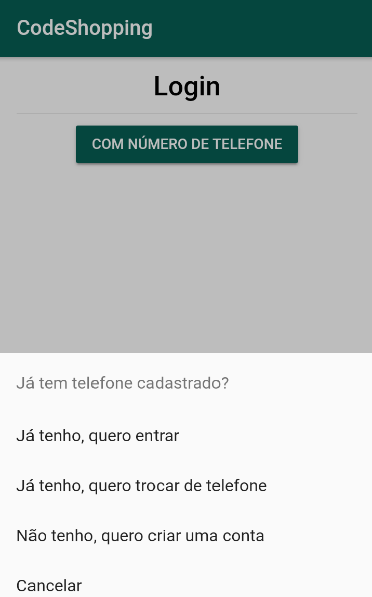

<div style="page-break-after: always;"></div>

Na criação de usuários, o usuário pode criar a sua conta utilizando o número de telefone, **que será validado utilizando os serviços do Firebase.** 


Após confirmar o número de telefone, caso já tenha registro na base de dados, será direcionado para a tela principal do aplicativo, onde terão 3 abas: Grupos, produtos e pedidos.

**Caso não tenha cadastro, será enviado para a tela de cadastro.**

<div style="page-break-after: always;"></div>

### 2.2 - Grupos e chat

#### 2.2.1 - Aba de grupos

Nesta aba, é possível visualizar os grupos do qual você faz parte, sendo possível enviar textos, gravar mensagem de áudio e enviar imagens no chat.

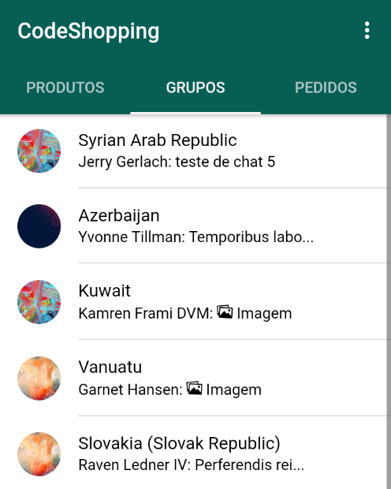

<div style="page-break-after: always;"></div>

#### 2.2.2 - Sala de chat

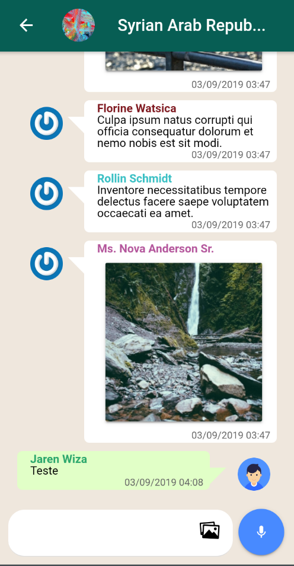


<div style="page-break-after: always;"></div>

### 2.3 - Produtos

#### 2.3.1 - Aba de produtos

Nesta aba, há uma lista de produtos disponíveis para serem encomendados

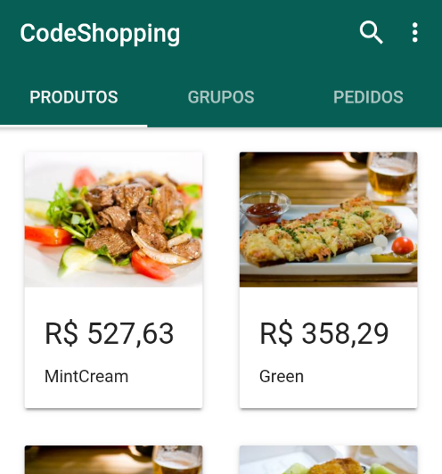

<div style="page-break-after: always;"></div>

#### 2.3.2 - Detalhes do produto

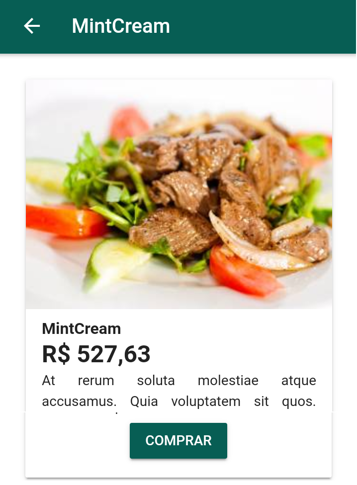


<div style="page-break-after: always;"></div>

### 2.4 - Pedidos

#### 2.4.1 - Aba de pedidos

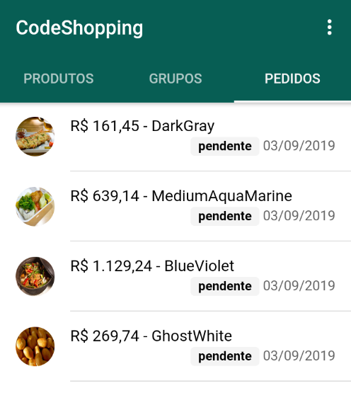


<div style="page-break-after: always;"></div>

#### 2.4.2 - Detalhes do pedido

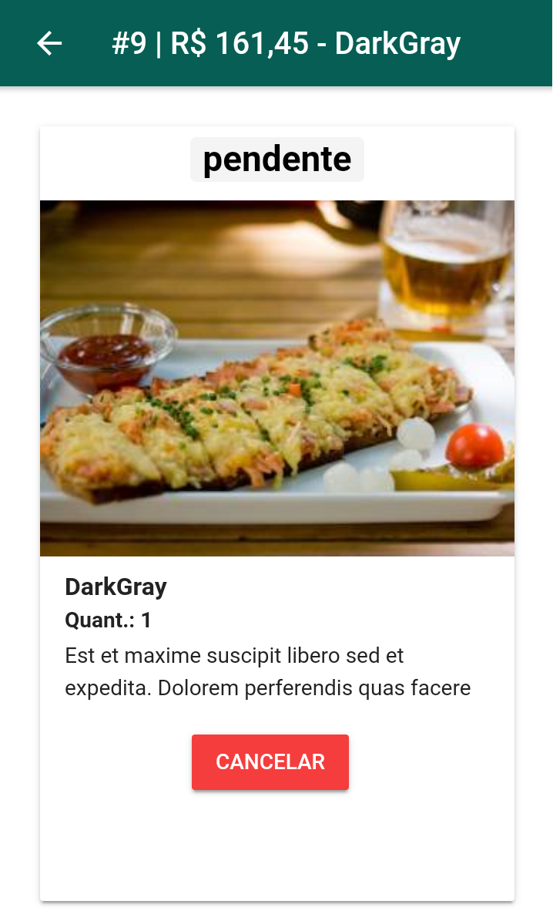


<div style="page-break-after: always;"></div>

## 3 - Ingresso em grupos

Os vendedores, através do painel administrativo, podem adicionar uma pessoa em um grupo de chat ou podem gerar links de convite, onde ao acessar o link, o aplicativo será aberto e será feito a solicitação de entrada no grupo.

## 4 - Notificações

A Aplicação conta com uma integração ao Firebase Cloud Messaging, que permite direcionar push notifications para os usuários, toda nova mensagem ou aprovação na solicitação de entrada em grupo, o usuário irá receber a notificações para alertar das mudanças.


<div style="page-break-after: always;"></div>

## 5 -  Funcionamento da aplicação - Painel Administrativo

O Painel foi construído utilizando o Angular, devido a seu ótimo ambiente para construções de SPAs, com lazy loading, code splitting e entre outros recursos.

Este painel só é acessível para os vendedores e administradores do sistema, pois possui funcionalidades administrativas, como:

* Categoria
* Produto
* Usuário
* Entradas
* Saidas
* Chats
* Pedidos


### 5.1 - Categorias

Listagem de categorias de produtos, podendo editar e remover

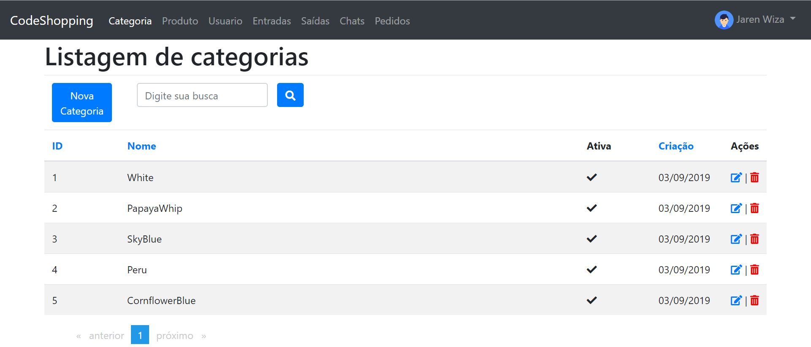

<div style="page-break-after: always;"></div>

### 5.2 - Produtos

Listagem de produtos, onde é possível criar/editar e remover. Também é possível adicionar categorias a um produto ou fotos.

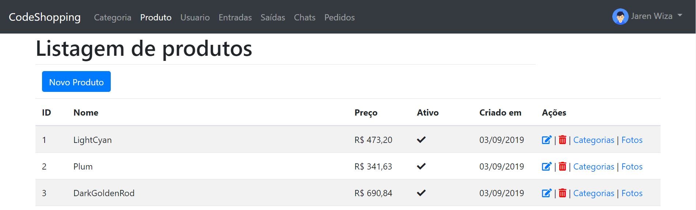


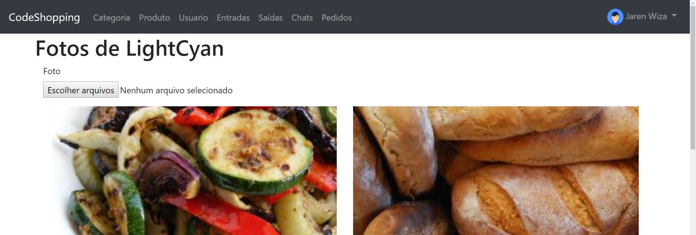


<div style="page-break-after: always;"></div>

### 5.3 - Entrada/Saida

Módulo onde é possível registrar a entrada e saída de produtos contidos no estoque

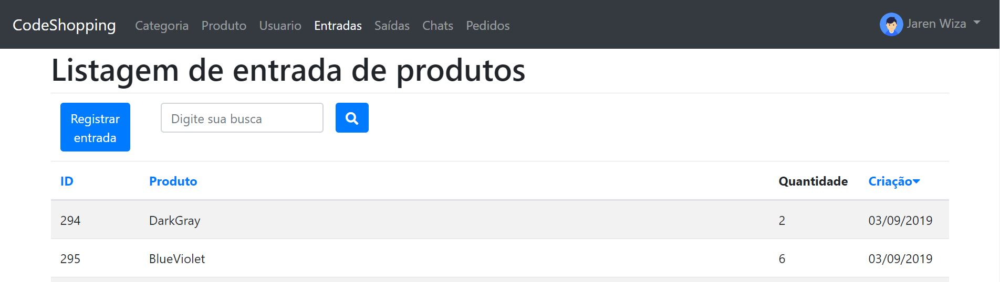


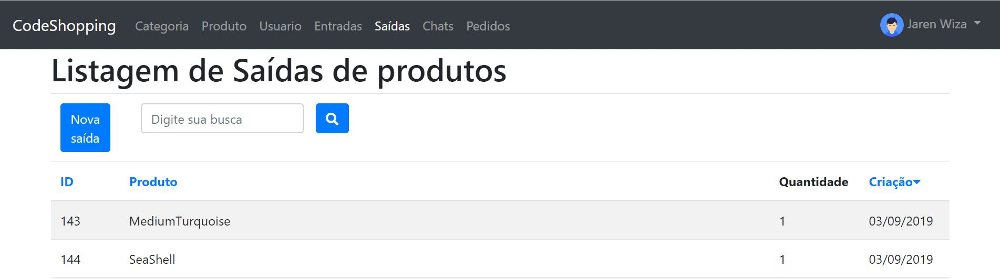

<div style="page-break-after: always;"></div>

### 5.4 - Chats

Módulo onde é possível administrar os chats do sistema, sendo possível criar novas salas, administrar membros e criar links de convites

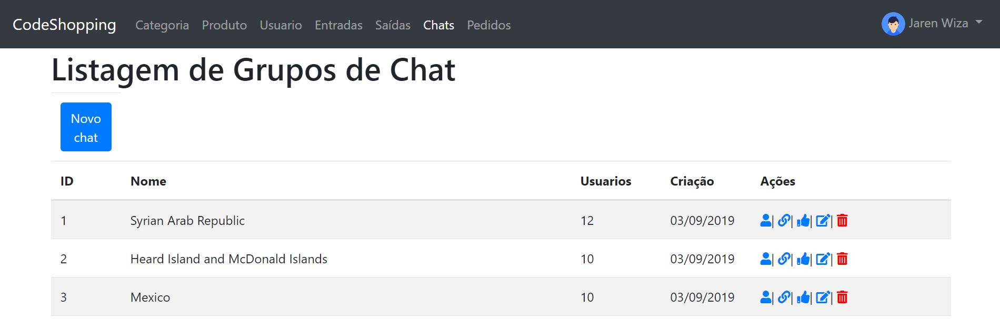


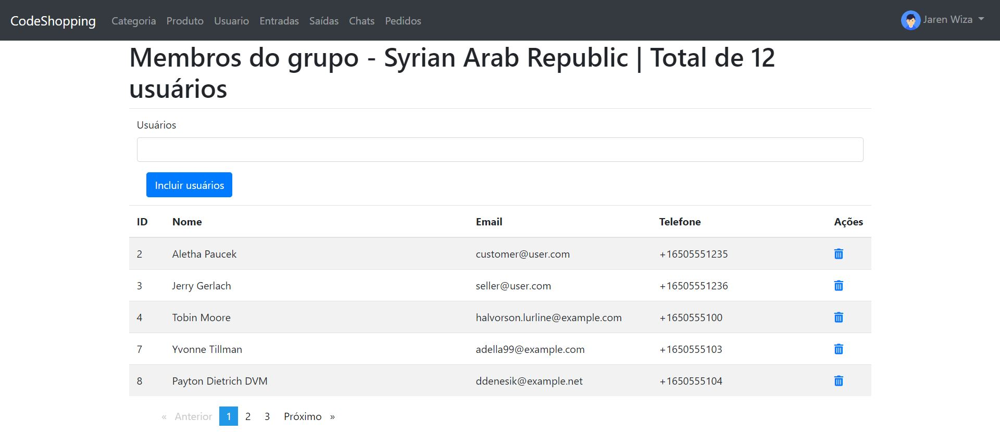


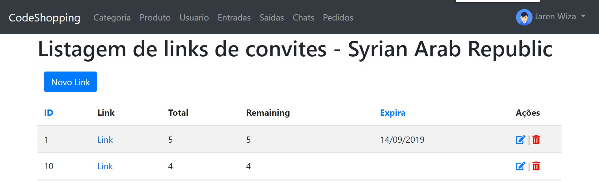


## 6 - Como executar?

Para executar a aplicação, é necessário:

### 6.1 -  Firebase

É necessário criar um projeto no firebase, registrando uma versão para: 

**web** e **mobile**

Após registrar o projeto, é necessário, criar um arquivo de config do firebase para a SPA(**web**), um para a **API** e outro arquivo para o **mobile**

**Para a API:**

* Gerar uma chave admin-sdk (service account)
* Inserir o arquivo .json gerado, na raiz da API

O arquivo de admin-sdk, assemelha-se  a este formato:

```json
{
    "type": "service_account",
    "project_id": "",
    "private_key_id": "",
    "private_key": "",
    "client_email": "",
    "client_id": "",
    "auth_uri": "",
    "token_uri": "",
    "auth_provider_x509_cert_url": "",
    "client_x509_cert_url": ""
  }


```


### 6.2 - Web

* Gerar o arquivo de autenticação
* Criar um arquivo chamado **firebase-config.ts** na raiz do projeto, no seguinte modelo:

```typescript
export default {
  apiKey: '',
  authDomain: '',
  databaseURL: '',
  projectId: '',
  storageBucket: '',
  messagingSenderId: '',
  appId: ''
};

```
> Preencher os dados, com os valores presentes, na config gerada no firebase


### 6.3 - Mobile

O Aplicativo requrer a instalação das dependências comuns para a execução do **Ionic3**

* Gerar o arquivo **google-services.json**
* Inserir este arquivo na pasta **<raiz do projeto>/platforms/android/app**

#### 6.3.1 - Primeiramente, clone o painel web

```shell
git clone https://github.com/WillRy/shopping-spa
```

#### 6.3.2 - Baixe as dependências

```shell
npm install
```

#### 6.3.3 - Execute o servidor

```she
ng serve
```

#### 6.3.4 - Acesse o painel

http://localhost:4200


### 6.4 - API

Os endpoints disponíveis da API estão no arquivo: **Insomnia-endpoints.json**


#### 6.4.1 - Primeiramente, clone a API:

```shell
git clone https://github.com/WillRy/shopping-api
```

#### 6.4.2 - Baixe as dependências

```shell
composer install
```

#### 6.4.3 - Rode as migrations e seed

```shell
php artisan migrate 

php artisan db:seed
```

#### 6.4.4 - Execute o servidor

```shell
php artisan serve
```


